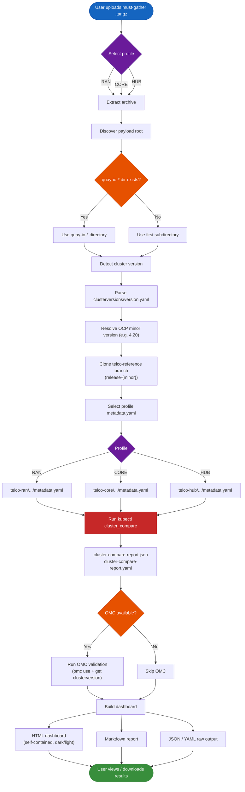

# RDS-Deviation-Must-Gather

OpenShift **must-gather** analysis for **RDS compliance deviation** reporting: **kube-compare** (`cluster_compare`) against the [telco-reference](https://github.com/openshift-kni/telco-reference) bundle, plus interactive HTML/Markdown dashboards and optional **OMC** validation.

Supports three telco profiles: **RAN** (vDU), **CORE**, and **HUB**.

---

## Web Application

A **Flask web application** provides browser-based must-gather analysis with automatic cluster version detection and reference branch matching.

### Pipeline Flow



### Prerequisites

| Requirement | Notes |
|-------------|-------|
| **Python 3.9+** | Tested on 3.9 (RHEL 9 / macOS), 3.11, and 3.12 |
| **git** | Used to clone the telco-reference repo (must be on PATH) |
| **kubectl-cluster_compare** | Auto-downloaded on first run if not found (see below) |
| **omc** *(optional)* | [OpenShift Must-gather Client](https://github.com/gmeghnag/omc) for extra cluster validation |

**kubectl-cluster_compare** is resolved in this order:

1. `CLUSTER_COMPARE_BIN` environment variable (explicit path)
2. `kubectl-cluster_compare` on PATH
3. `/tmp/kubectl-cluster_compare` (previously auto-downloaded)
4. **Auto-download** — the app fetches the correct binary for your OS/architecture from [GitHub releases](https://github.com/openshift/kube-compare/releases) (macOS arm64, macOS amd64, Linux amd64, Linux arm64)

### Quick start (local)

```bash
# 1. Clone the repository
git clone https://github.com/mmorency2021/RDS-Deviation-Must-Gather.git
cd RDS-Deviation-Must-Gather

# 2. Install Python dependencies
pip install -r requirements.txt

# 3. Start the web application
python run.py
```

The server starts on **http://localhost:5001**. On first run, if `kubectl-cluster_compare` is not found, it will be downloaded automatically for your platform.

### How to use

1. Open **http://localhost:5001** in your browser
2. Choose a source:
   - **Local path** *(default)* — paste the full path to a must-gather archive on your machine (any size, no upload needed)
   - **Upload** — upload a `.tar.gz` through the browser (up to 6 GB)
3. Select a profile: **RAN** (vDU), **CORE**, or **HUB**
4. Click **Analyse**
5. The status page shows live progress through each pipeline step
6. When complete, view the interactive HTML dashboard or download reports

### Output files

Each analysis job produces the following under `.tmp/jobs/<job-id>/`:

| File | Description |
|------|-------------|
| `dashboard.html` | Self-contained interactive HTML dashboard (dark/light mode, search, filters) |
| `report.md` | Markdown compliance report with all sections |
| `cluster-compare-report.json` | Raw kube-compare JSON output |
| `cluster-compare-report.yaml` | Raw kube-compare YAML output |
| `extracted/` | Extracted must-gather contents |

### Features

- Upload a must-gather `.tar.gz` (with drag & drop and progress bar) or point to a local file path
- Select profile: **RAN** (vDU), **CORE**, or **HUB**
- Auto-detects OpenShift cluster version from the must-gather archive
- Fetches the matching `release-{minor}` branch from [openshift-kni/telco-reference](https://github.com/openshift-kni/telco-reference)
- Auto-downloads `kubectl-cluster_compare` for the correct OS/architecture
- Runs `kubectl cluster_compare` against the profile-specific reference bundle
- Runs OMC validation (if [omc](https://github.com/gmeghnag/omc) is available)
- Generates self-contained HTML dashboard + Markdown report
- Download HTML, Markdown, or raw JSON output
- Dark/light mode theme toggle
- **SQLite-backed job persistence** — all jobs survive server and container restarts
- Recent jobs table with **filtering** (by text, profile, version, status) and **sortable columns** (click any header to toggle asc/desc)
- Inline partner name editing (double-click to rename a job for easy identification)

### Webapp environment variables

| Variable | Default | Description |
|----------|---------|-------------|
| `CLUSTER_COMPARE_BIN` | *(auto-detected)* | Path to `kubectl-cluster_compare` binary |
| `OMC_PATH` | *(auto-detected)* | Path to the `omc` binary |
| `MAX_UPLOAD_MB` | `6144` | Maximum upload size in MB |
| `FLASK_SECRET_KEY` | `rds-dev-key-change-in-prod` | Flask session secret key |

### Running on RHEL / Fedora

```bash
# Install Python and git
sudo dnf install -y python3 python3-pip git

# Clone and run
git clone https://github.com/mmorency2021/RDS-Deviation-Must-Gather.git
cd RDS-Deviation-Must-Gather
pip3 install -r requirements.txt
python3 run.py
# kubectl-cluster_compare is auto-downloaded for linux/amd64 on first run
```

### Running on macOS

```bash
# Python 3 and git are typically pre-installed, or:
brew install python git

git clone https://github.com/mmorency2021/RDS-Deviation-Must-Gather.git
cd RDS-Deviation-Must-Gather
pip3 install -r requirements.txt
python3 run.py
# kubectl-cluster_compare is auto-downloaded for darwin/arm64 (Apple Silicon) or darwin/amd64
```

### Data persistence (SQLite)

Job metadata is stored in a **local SQLite database** at `.tmp/jobs.db`. This means:

- All jobs (including in-progress ones) **survive server restarts** — no data loss on reboot or crash
- The recent jobs table on the home page always shows your full history
- Partner names, profiles, versions, and statuses are all persisted
- No external database server needed — SQLite is built into Python

On first startup after upgrading from the in-memory store, existing completed jobs are automatically migrated from disk (`job-meta.json` files) into the database.

### Container deployment (Podman / Docker)

The container image bundles all dependencies — no local setup needed.

```bash
# Clone the repository
git clone https://github.com/mmorency2021/RDS-Deviation-Must-Gather.git
cd RDS-Deviation-Must-Gather

# Build
podman build -t rds-webapp -f Containerfile .

# Run (ephemeral — data lost on container restart)
podman run -p 5001:5001 rds-webapp

# Run with persistent storage (recommended for production)
podman run -p 5001:5001 -v rds-data:/app/.tmp rds-webapp

# With a local must-gather directory mounted (to use local path mode):
podman run -p 5001:5001 -v rds-data:/app/.tmp -v /path/to/must-gathers:/data:ro rds-webapp
# Then use /data/your-must-gather.tar.gz as the local path in the UI
```

The `-v rds-data:/app/.tmp` mount persists the SQLite database, job outputs, and reference cache across container restarts. Without it, all data is lost when the container stops.

The container image includes `kubectl`, `kubectl-cluster_compare`, `omc`, `git`, and Python with all dependencies.

---

## Troubleshooting

| Problem | What to check |
|---------|---------------|
| `kubectl-cluster_compare` not found | Auto-downloaded on first run; or set `CLUSTER_COMPARE_BIN=/path/to/binary` |
| `exec format error` from kube-compare | Wrong architecture binary on PATH; the app auto-downloads the correct one for your OS/arch |
| `git clone` fails for telco-reference | Check internet connectivity; stale cache is auto-cleaned |
| No OMC section in dashboard | Install [omc](https://github.com/gmeghnag/omc) or set `OMC_PATH`; optional feature |
| Jobs disappear after restart | Should not happen with SQLite; check `.tmp/jobs.db` exists |
